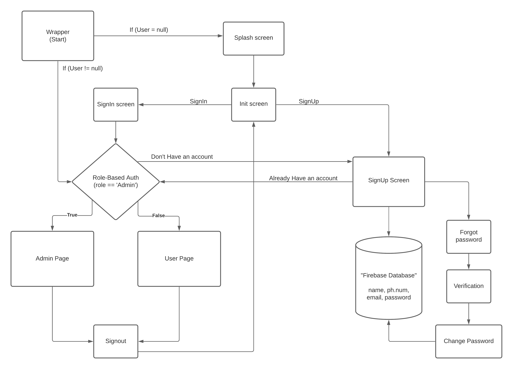
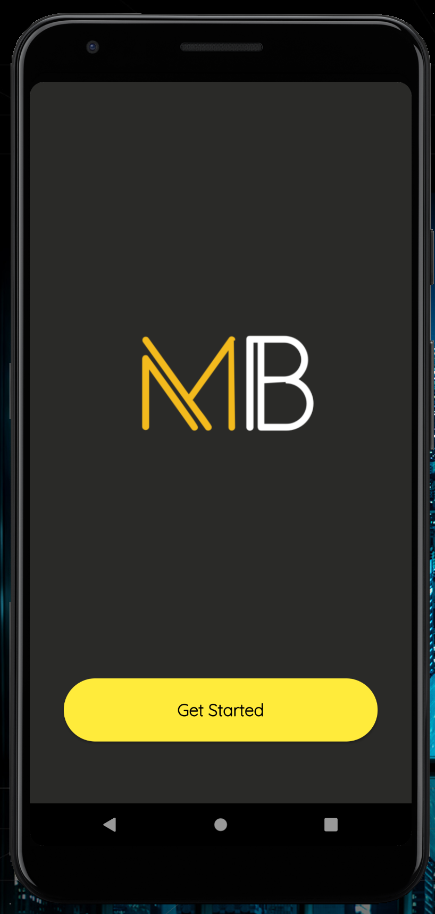
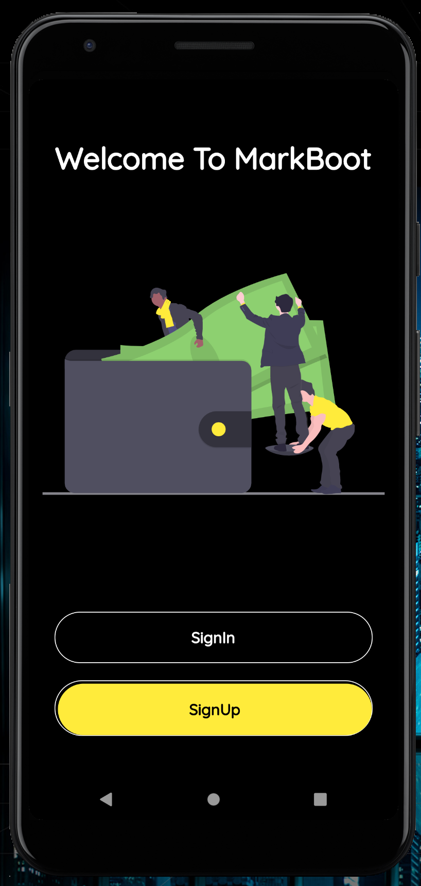
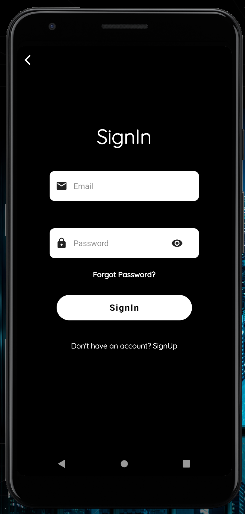
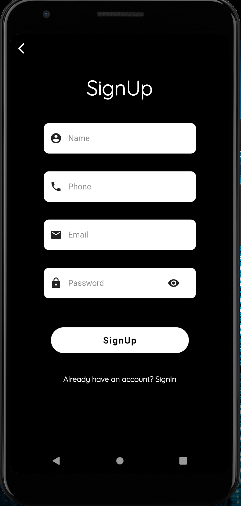
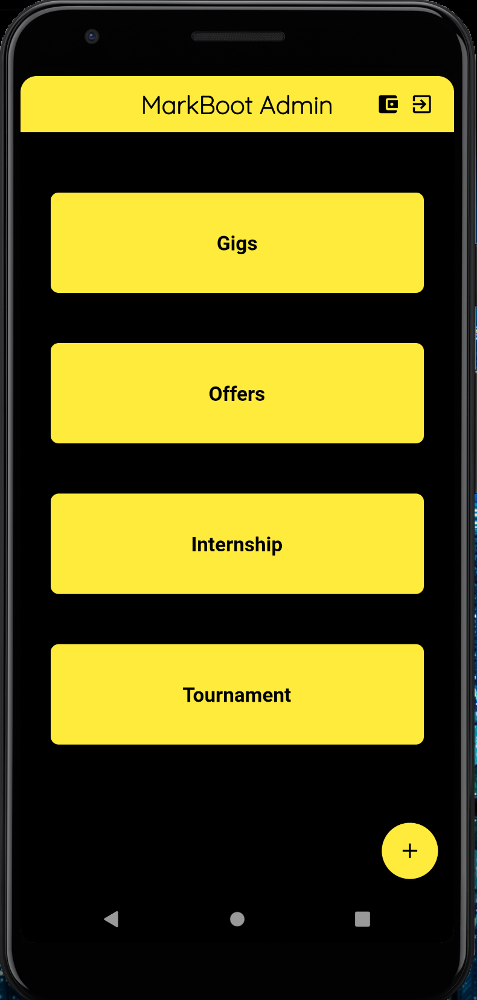
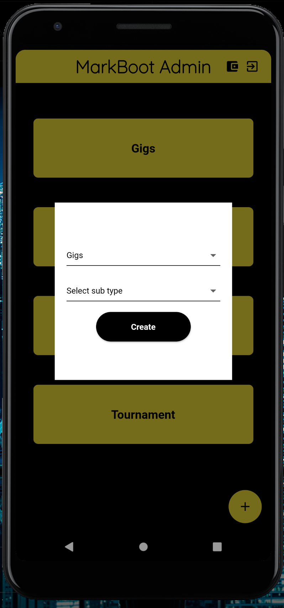
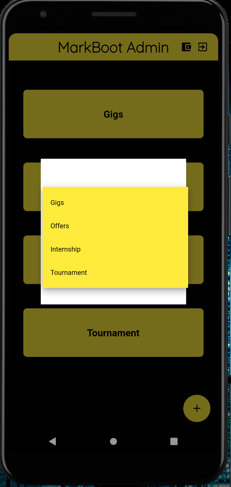
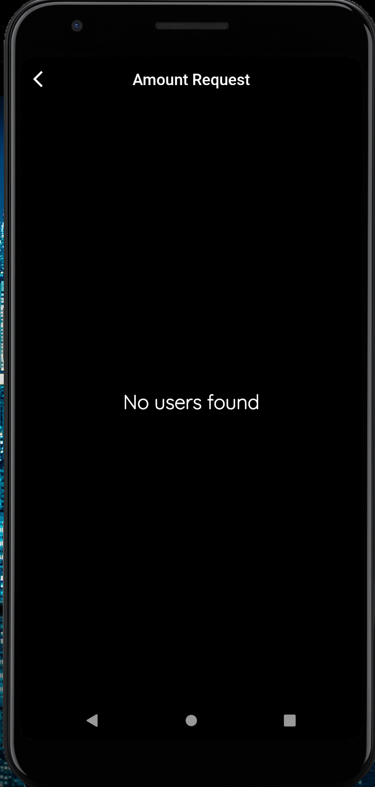
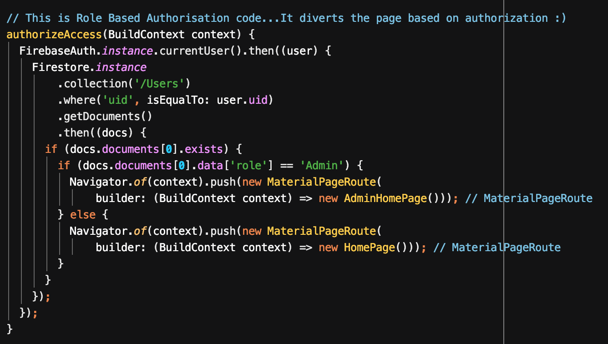

# My work

1. Used Color Theory for the Application UI.  
2. Resized MarkBoot Logo,  
3. Added extra Animations,  
4. Changed the Code Pattern,  
5. Solved Database issues,  
6. Solved the Login Issue,  
7. Changed the UI of the Application,  
8. Solved IOS side errors,  
9. Made Screens more Responsive,  
10. Created Role-Based authorization.  

# Basic Architecture of My Code

# ScreenShots of the Application. 

